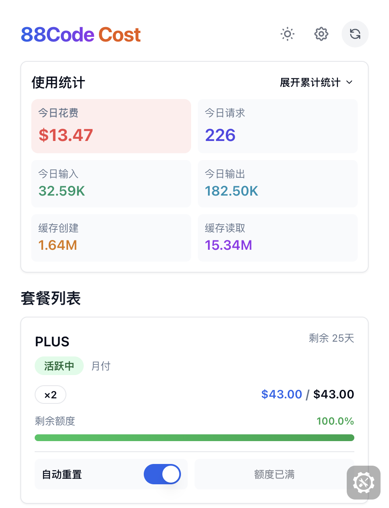

# 88Code Cost

<div align="center">
  
  <p><strong>智能额度监控工具，让您的 88Code 套餐使用一目了然</strong></p>
  <p>实时追踪套餐使用情况 · 智能自动重置 · 深色模式支持</p>


</div>

---

## 技术栈

本扩展基于现代 Web 技术构建，具有跨浏览器兼容性：

### 核心框架
- **Plasmo** v0.90.5 - 现代浏览器扩展开发框架（支持 Chrome MV3 / Firefox MV2）
- **React** 18.2.0 - UI 组件库
- **TypeScript** 5.3.3 - 类型安全的 JavaScript

### 样式与 UI
- **Tailwind CSS** 3.4 - 原子化 CSS 框架
- **shadcn/ui** - 高质量 React 组件库
- **Lucide Icons** - 现代图标库

### 状态管理
- **Plasmo Storage API** - 跨浏览器存储管理
- **React Hooks** - 状态和副作用管理

### 开发工具
- **pnpm** - 高效的包管理器
- **Eruda** 3.4.3 - 移动端调试工具（开发环境）
- **ESLint + Prettier** - 代码规范和格式化

### 浏览器支持
- Chrome / Edge (Manifest V3)
- Firefox (Manifest V2)
- 其他 Chromium 内核浏览器

### 核心特性
- **跨浏览器兼容** - 统一的 API 适配层
- **类型安全** - 完整的 TypeScript 类型定义
- **高性能** - 5 分钟智能缓存机制
- **现代化 UI** - 响应式设计 + 深色模式
- **自动同步** - 30 秒自动刷新数据

---

## 预览

<div align="center">
  
  <p><em>简洁直观的界面设计，套餐使用情况一目了然</em></p>
</div>

---

## 主要功能

### 实时监控
- 一键查看所有套餐的使用情况
- 可视化进度条显示剩余额度
- 自动计算重置倒计时

### 智能重置
- **18:55** 智能重置策略：优先重置未满额的套餐，预留最后一次给晚间兜底
- **23:55** 兜底重置：确保所有套餐额度不浪费
- 浏览器后台自动执行，无需手动操作

### 极致体验
- 现代化界面设计，支持深色模式
- 轻量级，低内存占用
- 自动刷新，数据实时同步
- 安全认证，数据本地存储

---

## 安装方式

### Chrome / Edge

#### 安装步骤
1. **下载扩展**
   - 从 [Releases](../../releases) 页面下载 Chrome 版本的 `.zip` 文件
   - 解压到本地文件夹

2. **安装到浏览器**
   - 打开 Chrome 浏览器
   - 访问 `chrome://extensions/`
   - 开启右上角的 **"开发者模式"**
   - 点击 **"加载已解压的扩展程序"**
   - 选择解压后的 `chrome-mv3-prod` 文件夹

3. **完成**
   - 扩展图标出现在浏览器工具栏即表示安装成功

### Firefox

#### 临时加载（开发测试）
1. **下载扩展**
   - 从 [Releases](../../releases) 页面下载 Firefox 版本的 `.zip` 文件
   - 解压到本地文件夹

2. **加载到浏览器**
   - 在地址栏输入：`about:debugging#/runtime/this-firefox`
   - 点击 **"临时载入附加组件"**
   - 导航到解压后的 `firefox-mv2-prod` 目录
   - 选择 **`manifest.json`** 文件（Firefox 会自动加载整个目录）
   - 点击 **"打开"**

3. **注意事项**
   - 临时加载的扩展在浏览器重启后会被移除
   - 虽然只能选择一个文件，但 Firefox 会加载整个扩展目录

---

## 使用指南

### 首次使用

#### 步骤 1：登录 88Code
1. 访问 [88code.org](https://www.88code.org)
2. 使用您的账号登录
3. 确保登录状态有效（不要退出登录）

#### 步骤 2：安装扩展
- 从 [Releases](../../releases) 页面下载对应浏览器的扩展包
- 按照[安装方式](#安装方式)部分的说明进行安装

#### 步骤 3：首次打开
1. 点击浏览器工具栏的扩展图标
2. 扩展会自动读取您的登录信息
3. 稍等片刻，数据加载完成

#### 步骤 4：查看数据
- **总览区域**：显示所有套餐的汇总数据（总额度/已用/剩余）
- **套餐列表**：显示每个活跃套餐的详细信息

### 核心功能使用

#### 1️⃣ 查看套餐详情

每个套餐卡片包含完整信息：
- **套餐名称**：如"基础版"、"专业版"等
- **套餐状态**：活跃中、已过期等
- **使用进度**：
  - 剩余额度 / 总额度（如：8,000 / 10,000）
  - 可视化进度条（绿色=充足，黄色=警告，红色=不足）
- **重置信息**：
  - 距离下次重置的倒计时（如：5小时30分钟后重置）
  - 剩余可重置次数
- **操作按钮**：手动重置按钮（点击立即重置该套餐）

#### 2️⃣ 手动刷新数据

两种刷新方式：
1. **自动刷新**：每 30 秒自动更新一次
2. **手动刷新**：
   - 点击右上角的刷新按钮
   - 立即获取最新数据
   - 适用于刚使用完额度，想查看最新余额的场景

#### 3️⃣ 启用智能重置

**开启步骤：**
1. 点击右上角的设置按钮
2. 找到"定时重置"选项
3. 开启 **"启用定时重置"** 开关
4. 系统将在 18:55 和 23:55 自动重置套餐

**注意事项：**
- 浏览器必须保持运行（可以最小化，但不要完全关闭）
- 不需要打开扩展，后台会自动执行
- 重置后会自动更新数据，下次打开扩展即可看到最新状态

#### 4️⃣ 切换主题

支持三种主题模式：
1. **浅色模式**：白色背景，适合白天使用
2. **深色模式**：黑色背景，适合夜间使用
3. **跟随88code**：自动跟随 88code.org 网站的主题

**切换方法：**
- 点击右上角的主题按钮
- 每次点击循环切换：浅色 → 深色 → 跟随88code → 浅色

#### 5️⃣ 手动重置单个套餐

除了定时自动重置，您也可以手动重置：
1. 在套餐卡片中找到"重置"按钮
2. 点击后立即重置该套餐
3. 重置成功后，额度恢复到满额状态

**使用场景：**
- 当前额度用完了，想立即重置继续使用
- 测试重置功能是否正常
- 不想等待自动重置时间

---

## 智能重置策略

### 为什么选择 18:55 和 23:55？

88Code 平台规定套餐重置需要间隔 **5 小时**。我们精心设计了两个重置时间点：

#### 18:55 - 智能策略
- **目标**：最大化利用白天的额度
- **逻辑**：
  - 如果套餐剩余重置次数 > 1 且未满额 → 立即重置
  - 如果套餐剩余重置次数 = 1 → 保留给晚间使用
  - 满额套餐不重置，节省重置次数

#### 23:55 - 兜底策略
- **目标**：确保当天额度不浪费
- **逻辑**：
  - 重置所有还有重置次数的套餐
  - 避免额度浪费

### 安全机制
- 随机延迟 0-15 秒，分散服务器压力
- 浏览器后台自动执行
- 无需打开扩展
- 不会影响浏览器性能

---

## 常见问题

### 认证相关

<details>
<summary><strong>Q: 为什么显示"未登录"？</strong></summary>

**A:** 请确保：
1. 已在 [88code.org](https://www.88code.org) 登录
2. 刷新扩展或重新打开
3. 如果问题持续，请尝试退出重新登录 88Code 网站
</details>

<details>
<summary><strong>Q: 扩展如何获取我的登录信息？</strong></summary>

**A:** 扩展会自动从 88code.org 网站读取您的认证信息（Token），所有数据均存储在本地，不会上传到任何第三方服务器。
</details>

### 数据相关

<details>
<summary><strong>Q: 数据多久更新一次？</strong></summary>

**A:**
- 打开扩展时自动获取最新数据
- 每 30 秒自动刷新一次
- 支持手动刷新（点击右上角刷新按钮）
</details>

<details>
<summary><strong>Q: 为什么有些套餐不显示？</strong></summary>

**A:** 扩展仅显示 **"活跃中"** 状态的套餐。已过期或暂停的套餐不会显示。
</details>

### 智能重置相关

<details>
<summary><strong>Q: 如何知道智能重置是否成功？</strong></summary>

**A:**
- 打开扩展，查看套餐的"可重置次数"
- 如果次数减少，说明重置已执行
- 查看"重置倒计时"是否更新
</details>

<details>
<summary><strong>Q: 关闭浏览器后还会自动重置吗？</strong></summary>

**A:** 不会。智能重置需要浏览器在后台运行。建议：
- 保持浏览器常驻后台
- 或在重置时间前确保浏览器处于运行状态
</details>

<details>
<summary><strong>Q: 可以自定义重置时间吗？</strong></summary>

**A:** 当前版本固定为 18:55 和 23:55。后续版本可能会添加自定义时间功能。
</details>

### 问题反馈

<details>
<summary><strong>Q: 遇到问题如何反馈？</strong></summary>

**A:** 您可以通过以下方式反馈：
1. 在 [GitHub Issues](../../issues) 提交问题
2. 提供问题截图和浏览器控制台日志（右键扩展 → 检查）
3. 说明复现步骤
</details>

---

## 隐私与安全

- **本地存储**：所有数据存储在本地，不上传到任何服务器
- **安全认证**：自动读取 88Code 官网的认证信息
- **最小权限**：仅请求必要的浏览器权限
- **开源透明**：完整源代码开放在 GitHub

---

## 支持项目

如果这个扩展对您有帮助，请考虑：

- 在 GitHub 上给我们一个 Star
- 向朋友推荐这个扩展
- 提交问题和建议
- 贡献代码和创意

---

## 开发指南

### 环境要求

- **Node.js**: >= 18.0.0
- **pnpm**: >= 8.0.0
- **操作系统**: macOS / Linux / Windows

### 本地开发

#### 1. 克隆项目
```bash
git clone https://github.com/yourusername/88code-cost.git
cd 88code-cost
```

#### 2. 安装依赖
```bash
pnpm install
```

#### 3. 启动开发模式

**Chrome / Edge 开发：**
```bash
pnpm dev
```
构建输出：`build/chrome-mv3-dev/`

**Firefox 开发：**
```bash
pnpm dev:firefox
```
构建输出：`build/firefox-mv2-dev/`

#### 4. 加载到浏览器

**Chrome / Edge：**
1. 打开 `chrome://extensions/` 或 `edge://extensions/`
2. 开启"开发者模式"
3. 点击"加载已解压的扩展程序"
4. 选择 `build/chrome-mv3-dev/` 目录

**Firefox：**
1. 打开 `about:debugging#/runtime/this-firefox`
2. 点击"临时载入附加组件"
3. 选择 `build/firefox-mv2-dev/manifest.json`

#### 5. 实时开发
- 修改代码后，Plasmo 会自动重新构建
- Chrome/Edge 会自动重载扩展
- Firefox 需要手动刷新（点击"重新加载"按钮）

### 构建生产版本

#### 构建单个平台
```bash
# Chrome
pnpm build:chrome

# Firefox
pnpm build:firefox

# Edge
pnpm build:edge
```

#### 构建所有平台
```bash
pnpm build:all
```

构建输出：
- `build/chrome-mv3-prod/` - Chrome 版本
- `build/firefox-mv2-prod/` - Firefox 版本
- `build/edge-mv3-prod/` - Edge 版本

### 代码质量检查

#### 类型检查
```bash
pnpm type-check
```

#### 代码检查
```bash
# 检查代码规范
pnpm lint

# 自动修复
pnpm lint:fix
```

#### 代码格式化
```bash
# 检查格式
pnpm format:check

# 自动格式化
pnpm format
```

### 项目结构

```
88code-cost/
├── assets/                 # 静态资源
│   ├── icon*.png          # 扩展图标
│   └── logo.png           # Logo
├── components/            # React 组件
│   ├── RefreshButton.tsx  # 刷新按钮
│   ├── Skeleton.tsx       # 骨架屏
│   ├── SubscriptionCard.tsx # 套餐卡片
│   └── UsageDisplay.tsx   # 使用情况显示
├── hooks/                 # React Hooks
│   ├── useAuth.ts         # 认证管理
│   ├── useDashboard.ts    # Dashboard 数据
│   └── useSubscriptions.ts # 订阅数据
├── lib/                   # 工具库
│   ├── api/
│   │   ├── client.ts      # API 客户端
│   │   └── config.ts      # API 配置
│   ├── browser-api.ts     # 浏览器 API 适配
│   └── storage/
│       └── index.ts       # Storage 管理
├── types/
│   └── index.ts           # TypeScript 类型
├── contents/              # Content Scripts
│   └── auth-handler.ts    # 认证处理
├── background.ts          # Background Service
├── popup.tsx              # 主弹窗
├── global.d.ts            # 全局类型声明
├── package.json           # 项目配置
├── tsconfig.json          # TypeScript 配置
└── tailwind.config.js     # Tailwind 配置
```

---

## 发布流程

### 自动发布（推荐）

本项目使用 GitHub Actions 自动化发布流程：

#### 步骤 1：更新版本号
```bash
# 编辑 package.json，修改 version 字段
# 例如：1.0.0 -> 1.1.0
```

#### 步骤 2：提交代码
```bash
git add .
git commit -m "chore: bump version to 1.1.0"
git push
```

#### 步骤 3：创建并推送标签
```bash
# 创建版本标签
git tag v1.1.0

# 推送标签到远程仓库
git push origin v1.1.0
```

#### 步骤 4：自动构建和发布
- GitHub Actions 会自动触发构建流程
- 构建完成后，自动创建 GitHub Release
- 自动上传三个平台的扩展包

#### 步骤 5：检查发布
访问 [Releases](../../releases) 页面，确认发布成功。

### 手动发布

如果需要手动发布：

```bash
# 1. 构建所有平台
pnpm build:all

# 2. 打包 Chrome 版本
cd build/chrome-mv3-prod
zip -r ../../88code-cost-chrome-v1.1.0.zip .
cd ../..

# 3. 打包 Firefox 版本
cd build/firefox-mv2-prod
zip -r ../../88code-cost-firefox-v1.1.0.zip .
cd ../..

# 4. 打包 Edge 版本
cd build/edge-mv3-prod
zip -r ../../88code-cost-edge-v1.1.0.zip .
cd ../..

# 5. 手动创建 GitHub Release，上传 zip 文件
```

---

## 贡献指南

### 提交问题

遇到问题或有建议？欢迎提交 Issue：

1. 访问 [Issues](../../issues)
2. 点击"New Issue"
3. 选择合适的模板（Bug Report / Feature Request）
4. 填写详细信息
5. 提交

### 贡献代码

欢迎提交 Pull Request：

#### 步骤 1：Fork 项目
点击右上角的"Fork"按钮

#### 步骤 2：克隆到本地
```bash
git clone https://github.com/yourusername/88code-cost.git
cd 88code-cost
```

#### 步骤 3：创建分支
```bash
git checkout -b feature/your-feature-name
# 或
git checkout -b fix/your-bug-fix
```

#### 步骤 4：开发和测试
```bash
# 安装依赖
pnpm install

# 启动开发
pnpm dev

# 运行检查
pnpm type-check
pnpm lint
pnpm format:check
```

#### 步骤 5：提交代码
```bash
git add .
git commit -m "feat: add your feature"
# 或
git commit -m "fix: fix your bug"
```

提交信息遵循 [Conventional Commits](https://www.conventionalcommits.org/)：
- `feat:` - 新功能
- `fix:` - Bug 修复
- `docs:` - 文档更新
- `style:` - 代码格式调整
- `refactor:` - 重构代码
- `test:` - 测试相关
- `chore:` - 构建工具或依赖更新

#### 步骤 6：推送和创建 PR
```bash
git push origin feature/your-feature-name
```

然后在 GitHub 上创建 Pull Request。

### 代码规范

- **TypeScript**: 所有代码必须使用 TypeScript
- **ESLint**: 遵循项目的 ESLint 规则
- **Prettier**: 使用 Prettier 格式化代码
- **注释**: 为复杂逻辑添加清晰的注释
- **类型**: 避免使用 `any`，尽量提供精确的类型

---

## 相关链接

- [88Code 官网](https://www.88code.org)
- [问题反馈](../../issues)
- [更新日志](CHANGELOG.md)
- [发布记录](../../releases)

---

## 许可证

本项目基于 [MIT License](LICENSE) 开源。

---

<div align="center">
  <p><strong>由 88Code 团队打造</strong></p>
  <p>
    <a href="https://www.88code.org">官网</a> ·
    <a href="../../issues">反馈问题</a> ·
    <a href="../../releases">下载更新</a>
  </p>
  <p><em>让 88Code 套餐管理更简单</em></p>
</div>
